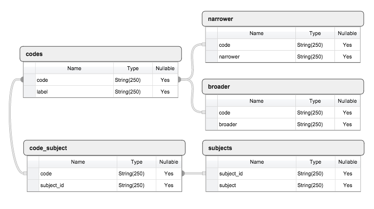

iconclass_tables
================

A relational database of the English version of the ICONCLASS visual notation system.

Schema:

I derived these tables from the RDF provided at <http://iconclass.org/help/lod>, made available under the [Open Database License](http://opendatacommons.org/licenses/odbl/1.0/)
